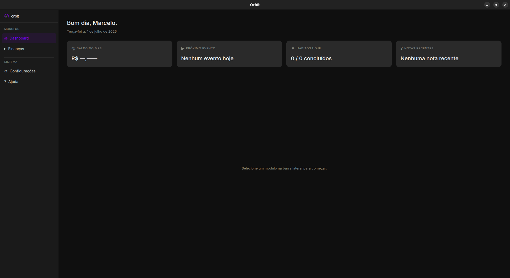

<p align="center">
  
</p>

<h1 align="center">Orbit</h1>

<p align="center">
  <strong>Sistema operacional pessoal.</strong><br>
  Finanças, agenda, notas e hábitos em um só lugar e 100% na sua máquina.
</p>

<p align="center">
  <a href="https://github.com/MarceloPanho/orbit/releases/latest"></a>
  
  
</p>

<p align="center">
  <a href="#baixar">Baixar</a> ·
  <a href="#o-que-tem-dentro">O que tem dentro</a> ·
  <a href="#privacidade">Privacidade</a> ·
  <a href="#desenvolvimento">Desenvolvimento</a>
</p>

---

<p align="center">
  
</p>

---

## Baixar

Pegue o instalador da sua plataforma na **[página de Releases](https://github.com/MarceloPanho/orbit/releases/latest)** e execute.

| Plataforma | Arquivo a baixar | Como instalar |
|---|---|---|
| **Windows** 10/11 | `Orbit-x.y.z-setup.exe` | Duplo clique. Cria atalho na área de trabalho. |
| **Linux** (qualquer distro) | `Orbit-x.y.z.AppImage` | `chmod +x Orbit-*.AppImage` e execute. **Se atualiza sozinho.** |
| **Linux** (Debian/Ubuntu) | `Orbit-x.y.z.deb` | `sudo apt install ./Orbit-*.deb`. Integra melhor ao sistema, mas **não** se atualiza sozinho. |

> [!TIP]
> **No Linux, prefira o AppImage.** É o único formato que recebe as atualizações
> automáticas descritas abaixo. O `.deb` precisa ser reinstalado à mão a cada versão.

> [!NOTE]
> **No Windows, o SmartScreen vai reclamar.** O instalador não é assinado
> digitalmente (o certificado é pago), então aparece *"O Windows protegeu o seu PC"*.
> Clique em **Mais informações** → **Executar assim mesmo**.

O primeiro boot leva de 30 a 60 segundos, o app está preparando o banco local.
As aberturas seguintes são imediatas.

### Atualizações

Depois de instalado, o Orbit cuida disso sozinho: ele checa por uma versão nova
ao abrir, baixa em segundo plano e instala no próximo reinício. Em
**Configurações → Atualizações** dá para forçar a verificação, acompanhar o
download e reiniciar na hora.

### Onde ficam os seus dados

Num banco SQLite **fora da pasta de instalação** `%APPDATA%\Orbit` no Windows,
`~/.config/Orbit` no Linux. Desinstalar e reinstalar preserva tudo; para fazer
backup, copie essa pasta.

## O que tem dentro

| | Status |
|---|---|
| 💸 **Finanças**: despesas e categorias de gasto | Disponível |
| 💸 **Finanças**: demais funcionalidades | Em construção |
| 🗓️ **Agenda** | Em construção |
| 📝 **Notas** | Em construção |
| 🔁 **Hábitos** | Em construção |

O Orbit é um app **desktop de verdade** (janela própria, atalho, ícone na barra),
não um site aberto no navegador. Ele roda inteiramente offline.

## Privacidade

`DISK:LOCAL · NET:MIN · PRIV:MAX`

Sem conta, sem login, sem telemetria, sem nuvem. Seus dados nunca saem da sua
máquina, ficam no SQLite local e ponto.

A **única** chamada de rede que o app faz é a checagem de nova versão contra as
Releases do GitHub, no boot e quando você clica em "verificar agora". É ela que
sustenta o auto-update. Fora isso, o Orbit não fala com ninguém.

## Desenvolvimento

**Requisitos:** PHP 8.3+ com `sqlite3`, `xml`, `curl` e `zip` · Composer 2 · Node.js 20+ · Git

```bash
git clone https://github.com/MarceloPanho/orbit.git
cd orbit
make install
```

Comandos do dia a dia:

```bash
make dev          # app desktop (NativePHP/Electron) + vite com hot reload
make web          # no navegador (http://localhost:8000)
make test         # roda a suíte de testes
make update       # atualiza este clone a partir do origin
make build-linux  # instalador local para TESTE — nunca distribua (leva sua APP_KEY junto)
make build-clean  # remove os artefatos de build
```

### Stack

[](https://www.php.net)
[](https://laravel.com)
[](https://livewire.laravel.com)
[](https://nativephp.com)
[](https://tailwindcss.com)
[](https://vite.dev)
[](https://sqlite.org)

O NativePHP embrulha o app num Electron e embarca o PHP junto é por isso que o
instalador não pede nenhuma dependência da sua máquina.
