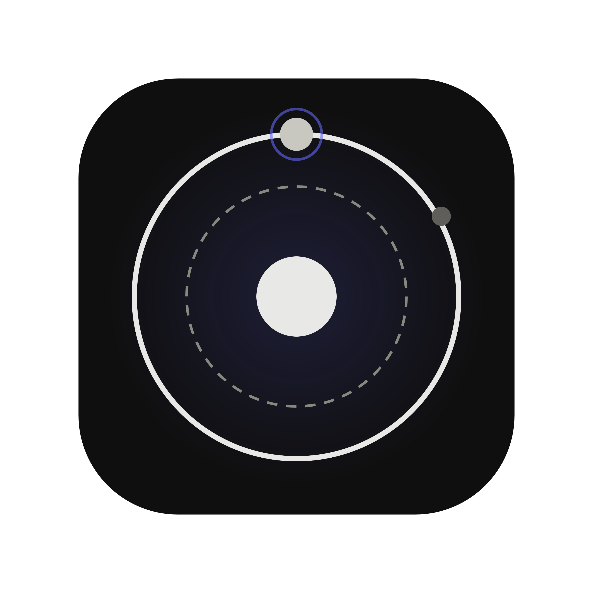

<p align="center">
  
</p>

<h1 align="center">Orbit</h1>

<p align="center"><em>Sistema operacional pessoal — finanças, agenda, notas e hábitos em um só lugar, 100% local.</em></p>

---

## O que é o Orbit

O Orbit é um aplicativo **desktop** para organizar a vida pessoal: finanças, agenda,
notas e hábitos. Ele roda inteiramente na sua máquina — os dados ficam em um banco
SQLite local, sem nuvem, sem conta, sem rede (`DISK:LOCAL · NET:OFF · PRIV:MAX`).

### Stack

- [Laravel](https://laravel.com) + [Livewire 3](https://livewire.laravel.com)
- [NativePHP Desktop v2](https://nativephp.com) (Electron) para o app desktop
- [Tailwind CSS v4](https://tailwindcss.com) + Vite
- SQLite (banco local)

## Como baixar e instalar

### Requisitos (Linux e Windows)

- **PHP 8.3+** com extensões `sqlite3`, `xml`, `curl`, `zip`
- **Composer 2**
- **Node.js 20+** e npm
- Git

### Linux

```bash
git clone https://github.com/MarceloPanho/orbit.git
cd orbit
make install
```

O `make install` faz tudo: instala as dependências PHP/JS, cria o `.env`, prepara o
banco, compila os assets, baixa o runtime do Electron e **cria o atalho "Orbit"**
(com o ícone oficial) no menu de aplicativos e na área de trabalho.

> No Ubuntu 24.04+ o instalador pede a senha do sudo uma vez para configurar o
> sandbox do Electron (`chrome-sandbox`).

### Windows

No PowerShell:

```powershell
git clone https://github.com/MarceloPanho/orbit.git
cd orbit
powershell -ExecutionPolicy Bypass -File scripts\install.ps1
```

O instalador faz o mesmo setup e **cria os atalhos "Orbit"** (com o ícone oficial)
na Área de Trabalho e no Menu Iniciar.

### Abrindo o app

Depois da instalação é só abrir o **Orbit** pelo atalho — o primeiro boot pode levar
de 30 a 60 segundos. Se preferir o terminal (Linux):

```bash
make dev   # app desktop (janela própria via NativePHP/Electron)
make web   # no navegador (http://localhost:8000)
make test  # roda a suíte de testes
```

Privacidade

O Orbit não faz nenhuma chamada externa em runtime: fontes self-hosted, banco local,
nenhuma telemetria. Seus dados são só seus.
